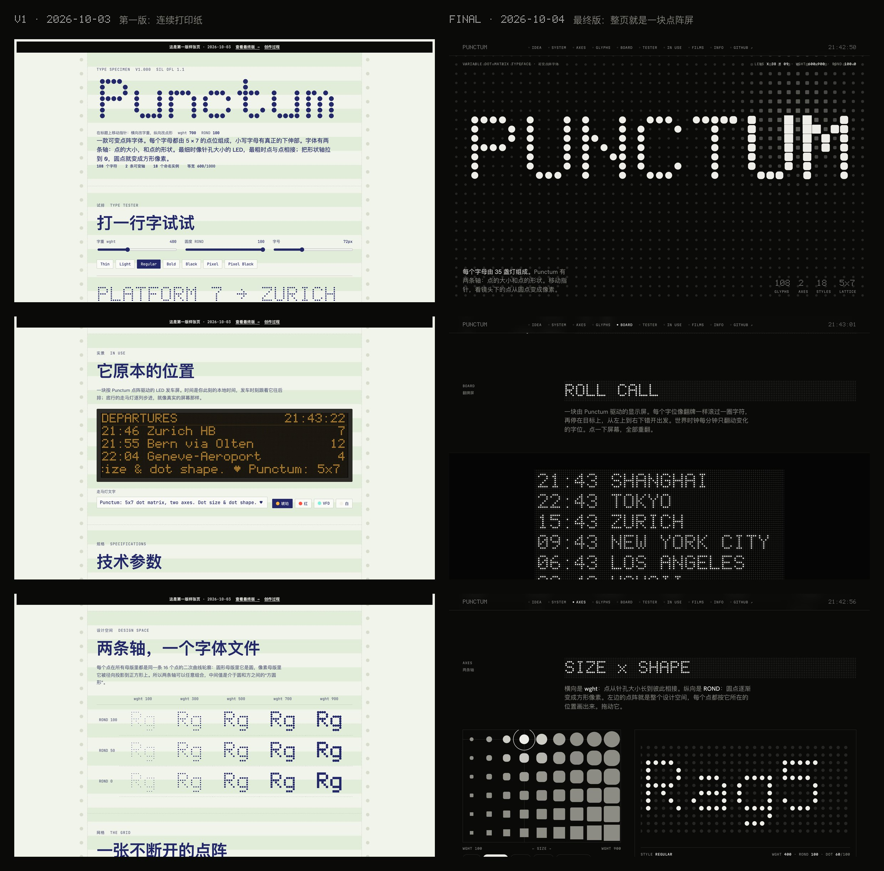

# How Punctum was made 创作过程

[中文](PROCESS.md) · [Website](https://sundyme.github.io/punctum/) · [First page](https://sundyme.github.io/punctum/first/) · [README](README.en.md)

[sundyme](https://x.com/sundyme) and Claude made Punctum together over three days. sundyme set the direction, sent references, reviewed every cut and said what was wrong. Claude did the design and all of the making: glyphs, font files, web page, films and music.

This is the timeline: what was asked, what was made, and which notes changed the direction. Times are Beijing time (UTC+8).

 

## 1 · One line 3 October

**17:14** sundyme:

> 你能不能设计一款dot matrix 字体 (Can you design a dot-matrix typeface?)

Eight minutes later there was an installable font and a first specimen page.

**The typeface** has not changed much since. The final version is still this design:

- **Name:** Punctum, Latin for "point".
- **Grid:** each letter is 5 × 7 dots, and lowercase gets 2 real descender rows, so g, j, p, q and y are not squashed.
- **One continuous lattice:** dot pitch 100 units, advance 600, line 1000. Neighbouring letters and lines all land on the same grid, so set text reads as one display.
- **Two axes:** `wght` 100–900 sets the dot size, from a pinhole LED to dots that touch. `ROND` 0–100 sets the dot shape, from a square pixel to a round dot.
- **One contour:** every dot in every master is the same 16-point quadratic contour. The square master is the circle projected radially onto a square, so the axes combine freely, and the values in between are "squircles".
- **Character set:** 108 glyphs, full ASCII plus departure-board symbols ° · • … × — ← ↑ → ↓ ♥ ■.
- **Build:** glyphs are drawn with `#` and `.` in [src/glyphs.py](src/glyphs.py). Python and fontTools build the variable font, 10 static styles and the web font.

**The first specimen page** was a continuous-form printout: green-bar paper, tractor-feed holes, blue-violet ribbon ink, and a teal phosphor screen in dark mode. It had a title that follows the pointer, a type tester, a design-space matrix, a grid inspector and an LED departures board with four lamp colours.

**17:41** sundyme asked for "another version that shows your own taste". That line became a different typeface, [Punctum Moderne](https://github.com/sundyme/punctum-moderne), a dot-matrix Didone. This repository continues the first version.

 

## 2 · The page, rebuilt 4 October

**15:49** sundyme sent [a video by @kayanoesasaki](https://x.com/kayanoesasaki/status/2105807084860104738) and asked for a deep redesign of the specimen: a page like a top type studio's project showcase, at Awwwards level, with motion in the spirit of the video.

Claude went through the video frame by frame and took two rules from it, rather than copying its look:

1. **Draw the dark dots too.** Every cell shows all 35 dots; the unlit ones are dimmed.
2. **Text arrives like a split-flap board.** Each cell rolls through a drum of characters before it stops, starting one after another from top left to bottom right, so the wave front reads `9876543210ZYX`.

The whole page was rebuilt around those two rules:

- **The page is a display.** Every line of Punctum sits on its own lattice of unlit dots. This uses the real font with a CSS background, not a canvas. It lines up dot for dot because the font's grid is exactly 0.1em both ways and font sizes snap to 10px steps.
- **One flap roll, used everywhere:** the hero title, every section heading, the clock in the nav, the big board and the footer.
- **A lens in the hero.** Dots under the pointer grow and turn square, so both axes are visible at once. When the pointer rests, the lens drifts on its own.
- **Black and white.** Colour appears only in "In use": a red elevator LED, a VFD, a thermal receipt and a reflective LCD.
- **Eight sections:** Idea, System, Axes, Glyphs, Board, Tester, In use, Info.

| | First version | Final version |
| --- | --- | --- |
| Metaphor | Continuous-form printout | The page is a dot-matrix display |
| Colour | Ribbon blue-violet / teal phosphor | Black and white; colour only in "In use" |
| Lattice | Lit dots only | Unlit dots drawn and aligned to the font grid |
| Motion | Title follows the pointer | Flap rolls, lens, per-digit clock |
| Companion faces | Atkinson Hyperlegible, JetBrains Mono | Hanken Grotesk, Martian Mono |

Both are online: [first version](https://sundyme.github.io/punctum/first/) · [final version](https://sundyme.github.io/punctum/)

 

## 3 · Films 4 October

Once the page was settled, several films followed the same day. All picture is rendered from code, and the first scores were synthesized in code too.

- **16:16 · 35 LIGHTS.** 60 seconds on "every letter is a decision about 35 lights". The typeface is the score: the lattice is a step sequencer, each row a pitch, dot shape sets the timbre (round is a sine, square is a square wave) and weight sets the level.
- **17:03 · Specimen demo.** The real page runs frame by frame on a virtual clock, a scripted cursor triggers the real interactions, and the footage sits on 3D screens with large camera moves. Four rounds:
  - 17:53 the hero was too long and many camera moves looked alike → each module got its own camera language and transition.
  - 18:29 the 5–10 s transitions were broken and the dot-text annotation overlays looked bad → opening rebuilt, overlays removed.
  - 19:17 the first shot was still slow; add one shot that glides the whole page → v4, 66 s.
- **19:37 · Integrated cut.** 35 LIGHTS and the specimen demo cut together, 92 s.
- **19:51 · Premiere.** sundyme asked Claude to skip the skills and use its native abilities. So there was no video framework: an 80-second 3D film written directly in WebGL2, where every dot is a glowing glass bead with depth of field, bloom and a floor reflection.
- **20:27–21:02 · Social cuts.** A 31-second cut entering 35 LIGHTS at the 30 s mark with a faster start, then 9:16 vertical and 2:3 for X.

 

## 4 · Checks 4 October

**21:19** sundyme asked whether the font collides with existing typefaces or carries copyright risk.

The findings are in the README under [Prior art](README.en.md#prior-art):

- The closest relative is [Doto](https://fonts.google.com/specimen/Doto) on Google Fonts, which also uses `wght` for dot size and `ROND` for round versus square.
- Punctum's glyphs were drawn one by one, and the font files are built by this repository's scripts. No files from any existing font were used.
- On the name: there is a 2023 Punctum made for the Powerhouse museum. The two are unrelated.

 

## 5 · Polish 5 October

This day was spent on 35 LIGHTS. Every note pointed at a timestamp, so every round landed.

- **15:07** Re-scored with ElevenLabs. Four candidates were generated; the one that sat best on the picture was cut bar by bar at 120 bpm (2-second bars).
- **15:20** "The 4–11 s name animation is too long … the 52–55 s animation would be better" → the ending's write animation moved to the opening.
- **15:28** "Improve the red glow at 32 s … redesign the 52–55 s animation" → the red LED got a real bloom, and the ending now splits one ■ into seven cells that resolve into PUNCTUM from the centre out, on the beat, instead of repeating the opening.
- **15:40** sundyme missed the earlier flap and slide sounds and found the final transition abrupt → the sounds came back and the ending transition was rebuilt.
- **17:31** "The front half moves too slowly; it feels like waiting" → the name reveal, the 16-number countdown and the weights were compressed, from 54 s to 42 s. The music was re-cut on bar lines.

**21:27** sundyme was preparing a third post on X for the specimen demo, and there was a mismatch: the video shows this page, but the public repository and site at the time belonged to Punctum Moderne. Hence this repository and [sundyme.github.io/punctum](https://sundyme.github.io/punctum/).

 

## Looking back Notes

- **Take rules from a reference, not pictures.** One video gave two rules, "draw the dark dots" and "flap roll", and the whole page grew from them.
- **Specific notes work best.** "4–11 s is too long" and "the red glow at 32 s" were fixed in one round each. A note like "make it better" first means guessing what matters.
- **The font stayed; the presentation changed.** The first version of the typeface is essentially the final one. Most of the three days went into the page and the films, and that is what lets people see what the font does well.
- **More freedom tends to give better work.** "Use your native abilities" is what produced the Premiere.

 

---

Punctum was designed by Claude (Opus 5.5) for sundyme. Fonts: SIL Open Font License 1.1. Code: MIT.
