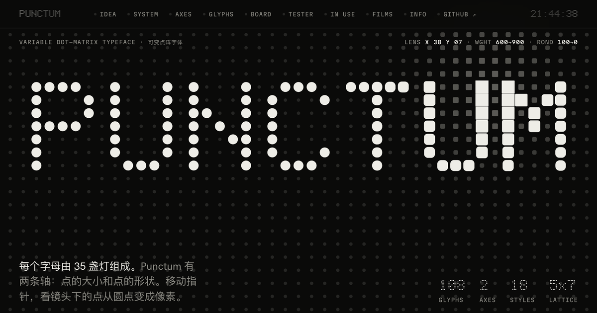
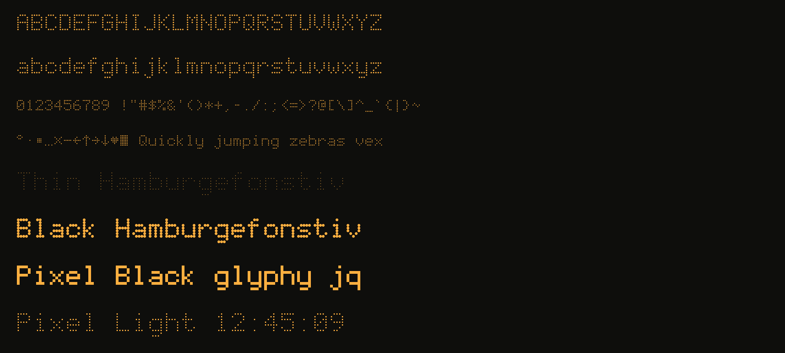
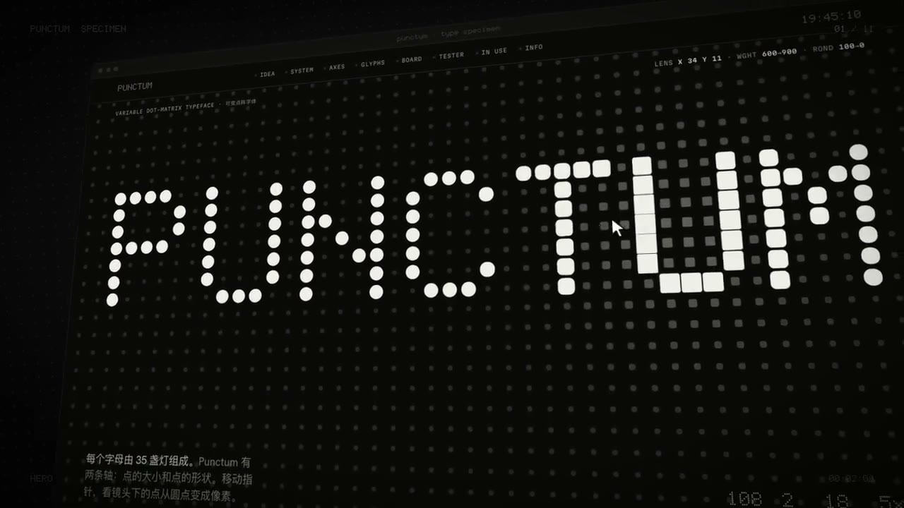
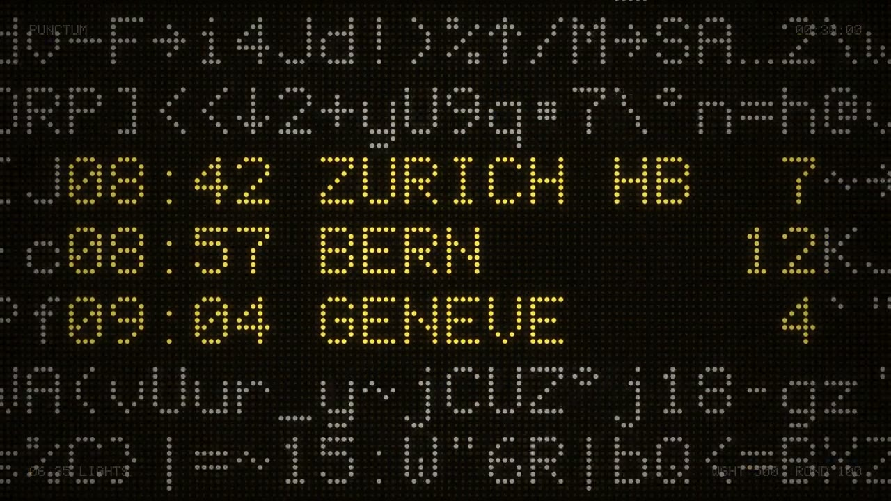
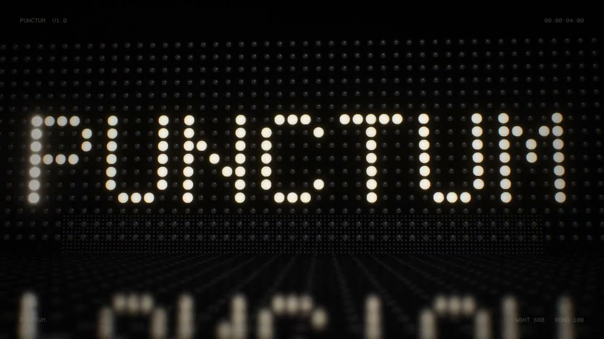

<a href="https://sundyme.github.io/punctum/"></a>

# Punctum <sub>可变点阵字体</sub>

**每个字母由 35 盏灯组成。** Punctum 是一款免费开源的可变点阵字体：5 × 7 点阵，两条轴分别控制点的大小和点的形状，从针孔 LED 到方块像素。

[网站](https://sundyme.github.io/punctum/) · [下载](https://github.com/sundyme/punctum/releases/latest/download/Punctum.zip) · [第一版页面](https://sundyme.github.io/punctum/first/) · [创作过程](PROCESS.md) · [English](README.en.md)

<br>

## 特点 <sub>Features</sub>

- **一张连续的点阵。** 点距 100 单位，字宽 600，行高 1000。相邻的字、上下的行，所有点都落在同一张网格上，排出来像一整块显示屏。
- **真正的下伸部。** 大写占 5 × 7，小写另有 2 行下伸部，g、j、p、q、y 不用压扁。
- **两条可变轴，一个字体文件。** 每个点在所有母版里都是同一条 16 个点的二次曲线，两条轴可以任意组合。
- **108 个字符。** 完整 ASCII，加上发车屏常用的 ° · • … × — ← ↑ → ↓ ♥ ■。
- **18 个命名样式。** Thin 到 Black 九个字重，各有圆点和 Pixel 两种。

<br>

## 两条轴 <sub>Axes</sub>

| 轴 | 范围 | 默认 | 作用 |
| --- | --- | --- | --- |
| `wght` | 100–900 | 400 | 点的大小。100 像针孔 LED，900 时点与点相接 |
| `ROND` | 0–100 | 100 | 点的形状。100 是圆点，0 是方形像素，中间是“方圆” |



<br>

## 使用 <sub>Usage</sub>

**桌面：** 下载 [Punctum.zip](https://github.com/sundyme/punctum/releases/latest/download/Punctum.zip)，安装 `Desktop/Punctum[ROND,wght].ttf` 这一个文件就够了。不支持可变字体的软件，装 `Desktop/Static/` 里的 10 个静态字重。

**网页：**

```css
@font-face {
  font-family: "Punctum";
  src: url("Punctum-VF.woff2") format("woff2");
  font-weight: 100 900;
}

.display {
  font-family: "Punctum";
  font-variation-settings: "wght" 400, "ROND" 100;
  font-size: 60px;   /* 10px 的整数倍，点阵就会落在整像素上 */
  line-height: 1;    /* 上下行的点阵连成一片 */
}
```

<br>

## 影片 <sub>Films</sub>

三支短片，画面和声音都是代码生成的。点击图片播放。

| [](https://sundyme.github.io/punctum/media/specimen-demo.mp4) | [](https://sundyme.github.io/punctum/media/35-lights.mp4) | [](https://sundyme.github.io/punctum/media/premiere.mp4) |
| --- | --- | --- |
| **Specimen** · 网页演示 · 1:06 | **35 Lights** · 字体即乐谱 · 0:42 | **Premiere** · WebGL2 点光 · 1:20 |

<br>

## 第一版和最终版 <sub>Two pages</sub>

字体在第一天就基本定型了。样张页做了两版：第一版是一张连续打印纸，最终版把整页做成一块点阵屏，暗的点也画出来，文字像翻牌一样滚动到位。


两版都在线上：[第一版](https://sundyme.github.io/punctum/first/) · [最终版](https://sundyme.github.io/punctum/)。从一句“你能不能设计一款 dot matrix 字体”到现在的完整过程，写在[创作过程](PROCESS.md)里。

<br>

## 从源码构建 <sub>Build</sub>

需要 Python 3 和 fontTools（`pip install fonttools brotli`）。

```bash
python3 src/build.py      # 字形 → fonts/ 里的可变字体、静态字重和 woff2
python3 site/build.py     # 字体 + 模板 → docs/ 里的网站
python3 tools/release.py  # 打包 dist/Punctum.zip
```

想改哪个字母，就改 [src/glyphs.py](src/glyphs.py) 里用 `#` 和 `.` 画的点阵，再重新构建。

```text
src/glyphs.py                  点阵源数据，108 个字符
src/build.py                   生成字体文件
src/specimen.template.html     最终版样张页模板
site/first.html                第一版样张页，保持 2026-10-03 的原样
site/build.py                  生成 docs/
docs/                          GitHub Pages 网站，含影片和图片
fonts/                         构建好的字体文件
```

<br>

## 先例与差异 <sub>Prior art</sub>

用点来组字是很老的想法，Punctum 不是第一款点阵字体，也不是第一款用轴来控制点的大小和形状的字体。下面是我们知道的近亲。

| 字体 | 作者 / 年份 | 共同点 | 不同之处 |
| --- | --- | --- | --- |
| [Doto](https://fonts.google.com/specimen/Doto) | Óliver Lalan · 2024 · OFL | 可变点阵；`wght` 控制点的大小，`ROND` 控制点的圆和方 | 思路最接近。Punctum 用 5 × 9 网格（大写占 5 × 7），Doto 用 6 × 10；Punctum 的字形逐字写成，字体文件由本仓库脚本生成，没有使用 Doto 的任何文件 |
| [Powerhouse Punctum](https://matterofsorts.com/) | Vincent Chan · 2023 · Powerhouse 博物馆定制 | 同名；同样来自打孔卡和点阵打印机 | 两者互不相关 |

5 × 7 网格的自由度很小，许多大写字母难免与几十年来的 LCD 和打印机字库相似，这是这种网格的共同语汇。

<br>

## 许可 <sub>License</sub>

- 字体：[SIL Open Font License 1.1](OFL.txt)。可以免费用于任何项目，包括商业项目，也可以修改和再发布。
- 代码和网站：[MIT](LICENSE)。

Punctum 由 Claude（Opus 5.5）为 [sundyme](https://x.com/sundyme) 设计。
